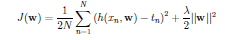

# Implementing gradient descent algorithm to train linear regression models with and without L2 regularization 

## Description

In this project, I implement the gradient descent algorithm and use it to
train linear regression models for the Athens houses dataset and an artificial dataset with
and without L2 regularization using Python. Implementation details are given below and can also be found in the **gradient-descent.pdf** file. Please view the **Report.docx** file for implementation results.

## Implementation

In this exercise, you are asked to implement de gradient descent algorithm and use it to
train linear regression models for the Athens houses dataset and an artificial dataset with
and without L2 regularization. The input data is available at [http://ace.cs.ohio.edu/~razvan/courses/ml4900/hw02.zip](http://ace.cs.ohio.edu/~razvan/courses/ml4900/hw02.zip)
shown in the table below. Write code only in the Python files indicated in bold.

<pre>
ml4900/
  hw02/
    code/
      <b>simple.py
      multiple.py 
      polyfit.py</b>
      train_test_line.png
    data/
      simple/
        train.txt, test.txt
      multiple/
        train.txt, test.txt
      polyfit/
        train.txt, test.txt, devel.txt
</pre>

1\. **Feature Scaling**

To improve the convergence of gradient descent, it is important that the features are
scaled so that they have similar ranges. Implement the standard scaling method using
the skeleton code in **scaling.py**.

2\. **Simple Regression**

Train a simple linear regression model to predict house prices as a function of their
floor size, by running gradient descent for 500 epochs with a learning rate of 0.1. Use
the dataset from the folder *hw02/data/simple*. Plot ***J***(**w**) vs. the number of epochs
in increments of 10 (i.e. after 0 epochs, 10 epochs, 20 epochs, ...). After training print
the parameters and compare with solution from normal equations. Plot the training
using the default blue circles and test examples using lime green triangles. On the
same graph also plot the linear approximation.

3\. **Multiple Regression**

Train a multiple linear regression model to predict house prices as a function of their
floor size, number of bedrooms, and year. Run gradient descent for 200 epochs with a
learning rate of 0.1. Use the the dataset from the folder *hw02/data/multiple*. Plot
***J***(**w**) vs. the number of epochs in increments of 10 (i.e. after 0 epochs, 10 epochs,
20 epochs, ...). After training print the parameters and compare with solution from
normal equations.

4\. **Polynomial Curve Fitting** 

In this exercise, you are asked to use gradient descent to train a linear regression model,
with and without regularization, on the artificial dataset from the folder *hw02/data/polyfit*.

(a) Select 30 values for *x* ∈ [0, 1] uniformly spaced, and generate corresponding t
values according to *t*(*x*) = *sin*(2π*x*) + *x*(*x* + 1)/4 + ε, where ε = N(0, 0.005) is a
zero mean Gaussian with variance 0.005. Save and plot all the values. Done in **dataset.txt**.

(b) Split the 30 samples (*x*n,*t*n) in three sets: 10 samples for training, 10 samples for
validation, and 10 samples for testing. Save and plot the 3 datasets separately.
Done in **train.txt**, **test.txt**, **devel.txt**.

(c) Consider a linear regression model with polynomial basis functions, trained with the objective shown below:

Show the gradient update used for minimizing ***J***(**w**).

(d) Train and evaluate the linear regression model in the following scenarios:

1. **Without regularization:** Using for M the value that obtained the lowest test
RMSE in the [linear regression](https://github.com/taiman9/Machine-learning/tree/master/linear-regression) homework, run gradient descent with a learning rate that
is tuned on the training data using the following consecutive powers of 10:
{0.0001, 0.001, 0.01, 0.1, 1, 10}. Plot ***J***(**w**) vs. epochs and select the largest
learning rate that leads to a smooth, decreasing behavior of ***J***(**w**). If convergence appears to be too slow, 
you may consider consecutive powers of 2 in the same range for the learning rate. Once the learning rate is selected, 
run gradient descent at least as long as the relative decrease in ***J***(**w**) is 0.001 o larger after each epoch. 
Compare the trained parameters with the solution obtained in the first homework for the same degree M.

2. **With regularization:** Fixing M = 9 and λ to the value tuned in the first homework, repeat the experiments above, 
this time with regularization. Compare the trained parameters with the solution obtained in the first homework for
the same degree M and λ.

• **Stochastic Gradient Descent**(*)

Implement SGD and run it for problems 1, 2, and 3 above, using the same hyperparameters (learning rate, number of epochs, 
M, and lambda). Compare the SGD solution to the batch GD solution. Does SGD need fewer or more epochs
to arrive at the same parameters as batch GD? If fewer, how many epochs are sufficient?
