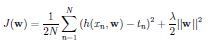

# Linear Regression with and without L2 regularization using Python 3 

## Description

In this project, I implement an experimental evaluation of linear regression on the Athens houses dataset, 
and on an artificial dataset with and without L2 regularization using Python 3. Implementation details are given below and can be found in the *Implementation* section in **linear-regression.pdf**. Please view the **Report.pdf** file for implementation results.

## Implementation

In this exercise, you are asked to run an experimental evaluation of linear regression on the Athens houses dataset, 
and on an artificial dataset with and without L2 regularization. The input data is available at [http://ace.cs.ohio.edu/~razvan/courses/ml4900/hw01.zip](http://ace.cs.ohio.edu/~razvan/courses/ml4900/hw01.zip).
Make sure that you organize your code in folders as shown in the table below. Write code only in the Python files 
indicated in bold.

<pre>
ml4900/
  hw01/
    code/
      <b>simple.py
      multiple.py
      polyfit.py</b>
      train test line.png
    data/
      simple/
        train.txt, test.txt
      multiple/
        train.txt, test.txt
      polyfit/
        train.txt, test.txt, devel.txt
</pre>

1\. **Simple Regression**

Train a simple linear regression model to predict house prices as a function of their
floor size, based on the solution to the system with 2 linear equations discussed in
class. Use the dataset from the folder *hw01/data/simple*. Python3 skeleton code is
provided in **simple.py**. After training print the parameters and report the RMSE and
the objective function values on the training and test data. Plot the training using the
default blue circles and test examples using lime green triangles. On the same graph
also plot the linear approximation.

2\. **Multiple Regression** 

Train a multiple linear regression model to predict house prices as a function of their
floor size, number of bedrooms, and year. Use the normal equations discussed in class,
and evaluate on the dataset from the folder *hw01/data/multiple*. Python3 skeleton
code is provided in **multiple.py**. After training print the parameters and report the
RMSE and the objective function values on the training and test data. Compare the
test RMSE with the one from the simple case above.

3\. **Polynomial Curve Fitting**

In this exercise, you are asked to run an experimental evaluation of a linear regression
model, with and without regularization. Use the normal equations discussed in class,
and evaluate on the dataset from the folder *hw01/data/polyfit*.

(a) Select 30 values for x ∈ [0, 1] uniformly spaced, and generate corresponding t
values according to *t*(*x*) = *sin*(2π*x*) + *x*(*x* + 1)/4 + ε, where ε = *N*(0,0.005) is a
zero mean Gaussian with variance 0.005. Save and plot all the values. Done in **dataset.txt**.

(b) Split the 30 samples (*x*n,*t*n) in three sets: 10 samples for training, 
10 samples for validation, and 10 samples for testing. Save and plot the 3 datasets separately.
Done in **train.txt**, **test.txt**, **devel.txt**.

(c) Consider a linear regression model with polynomial basis functions, trained with the objective shown below:

Show the closed form solution (vectorized) for the weights **w** that minimize ***J***(**w**).

(d) Train and evaluate the linear regression model in the following scenarios:

1. **Without regularization:** Use the training data to infer the parameters w for all values of M ∈ [0, 9]. 
For each order M, compute the RMSE separately for the training and test data, and plot all the values 
on the same graph, as shown in class.

2. **With regularization:** Fixing M = 9, use the training data to infer the parameters w, one parameter vector 
for each value of ln λ ∈ [−50, 0] in steps of 5. For each parameter vector (lambda value), compute the RMSE 
separately for the training and validation data, and plot all the values on the same graph,as shown in class. 
Select the regularization parameter that leads to the parameter vector that obtains the lowest RMSE on the 
validation data, and use it to evaluate the model on the test data. Report and compare the test RMSE with the one 
obtained without regularization.

(e) [Bonus] Train and evaluate the linear regression model above using **sklearn**. For ridge regression, add the 
validation data to the training data and use the *RidgeCV* function to tune the hyper-parameter λ (use 10 folds).
