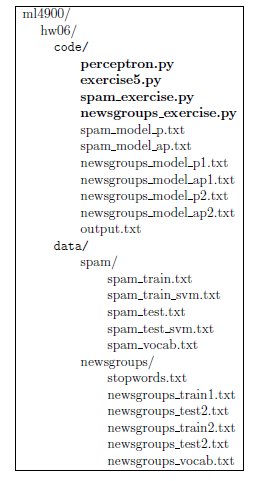
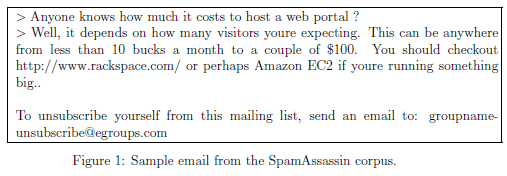
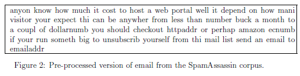

# Perceptrom algorithms to evaluate perceptron convergence and text classification using Python

## Description

In this project, I implement 3 versions of the perceptron algorithm: the perceptron, the
average perceptron, and the kernel perceptron to evaluate perceptron convergence and for *Spam vs. Non-spam* and *Atheism vs. Religion* text classification tasks using Python. Implementation details are given below and can be found in the *perceptron.pdf* file. Please view the *Report.pdf* file for implementation results.

## Implementation

Implement the 3 versions of the perceptron algorithm discussed in class: the perceptron, the
average perceptron, and the kernel perceptron. The algorithms should stop after achieving
convergence, or after a predefined number of epochs T, whichever comes first. Make sure
that you organize your code in folders as shown in the table below. Write code only in the
Python files indicated in bold.

1\. **Perceptron Convergence:** Validate experimentally the conclusions you reached for
Exercise 5 in the previous assignment. For 5(a), show that the perceptron algorithm
hits the same weight vector at different epochs during training and thus it will run
forever. Report the weight vector at the end of each epoch. For 5(b), show the
number of epochs the kernel perceptron needed to converge and the values of the
dual parameters at the end, as well as after each epoch. Make sure you process the
training examples in the order given in the assignment. In **perceptron.py** you should
implement these five functions:

(a) *perceptron_train(data, labels, epochs)* trains the vanilla perceptron algorithm and returns the weight vector.

(b) *aperceptron train(data, labels, epochs)* trains the average perceptron algorithm and returns the average weight vector.

(c) *perceptron_test(w, data)* test a perceptron with weights w and returns a vector with the labels on the test examples in data.

(d) *kperceptron_train(data, labels, epochs, kernel)* trains the kernel perceptron algorithm and returns the vector α of parameters.

(e) *kperceptron_test(alpha, tlabels, tdata, data, kernel)* tests the kernel perceptron algorithm with parameters alpha, support vectors tdata and their labels tlabels, and returns a vector with the labels on the test examples in data.

Write the code for validating Exercise 5 in the file exercise5.py.

2\. **Spam vs. Non-Spam:** In this problem, you will train and evaluate spam classifiers using the perceptron and average perceptron algorithms. The dataset contains two files: **spam_train.txt** with 4,000 training examples and **spam test.txt** with 1,000 test examples. The dataset is based on a subset of the [SpamAssassin Public Corpus](http://spamassassin.apache.org/old/publiccorpus)
Each line in the training and test files contains the pre-processed version of one email.The line starts with the label, followed by 
the email tokens separated by spaces.

[Figure 1](images/fig2.png) shows a sample source email, while [Figure 2](images/fig3.png) shows its pre-processed version
in which web addresses are replaced with the “httpaddr” token, numbers are replaced with a “number” token, dollar amounts are replaced with “dollarnumb”, and email addresses are replaced with “emailaddr”. Furthermore, all words are lower-cased, HTML tags are removed, 
and words are reduced to their stems i.e. “expecting”, “expected”, “expectation” are all replaced with “expect”. Non-words and punctuation symbols are removed.

(a) Create a vocabulary file spam **vocab.txt** that contains a list of only the (pre-processed) tokens that appear at least 30 times in the training examples. The file should contain one token per line in the format \<id> \<token>, where each token is associated a unique integer identifier. The tokens should be listed in increasing order of their identifiers, starting from 1. See for example the vocabulary file **newsgroups_vocab.txt** that we generated for the newsgroup classification problem. Implement the function that creates the vocabulary in **spam_exercise.py**.

(b) For each training and test example, create a sparse feature vector representation wherein each example is represented as one line in the file using the format \<label> \<id1>:\<val1> \<id2>:\<val2> ..., where the id’s are listed in increasing order and correspond only to tokens that appear in that example (use 1 for all values, representing that fact that the corresponding token appeared in the example). An example of this sparse representation can be seen in the file **newsgroups_train1.txt** that we generated for the newsgroup classification problem. Save the new version of the dataset in the files **spam_train_svm.txt** and **spam_test_svm.txt**. 
Implement the function that creates the sparse feature vector representations in **spam_exercise.py**.

(c) Write an additional function *read_examples(file name)* inside **perceptron.py** that reads all examples from a file with sparse feature vectors and returns a tuple (data, labels) where the data is a two dimensional array containing all feature vectors, one per row, in the same order as in the file, and the labels is a vector containing the corresponding labels.

(d) Train the perceptron algorithm until convergence, by reading the training examples from **spam_train_svm.txt** and by calling *perceptron_train(data, labels, epochs)* in the code you write inside **spam_exercise.py**. Process the examples in the order they are listed in the files. Report the number of epochs needed for convergence, the number of mistakes made during each epoch, and the total number of mistakes made, and save the returned parameter vector in **spam_model_p.txt**. Test the perceptron algorithm by reading the parameter vector from **spam_model_p.txt** and the test examples from **spam_test_svm.txt** and calling *perceptron_test(w, data)* in the code inside **spam_exercise.py**. Report the test accuracy.

(e) Train the average perceptron algorithm until the corresponding perceptron convergences, by reading the training examples from 
**spam_train_svm.txt** and by calling *aperceptron_train(data, labels, epochs)* in the code inside **spam_exercise.py**.
Process the examples in the order they are listed in the files. Report the number of epochs needed for convergence, the number of mistakes made during each epoch, and the total number of mistakes made, and save the returned average parameter vector in **spam_model_ap.txt**. Test the average perceptron algorithm by reading the parameter vector from **spam_model_ap.txt** and the test examples from **spam_test_svm.txt** and calling *perceptron_test(w, data)* in the code inside **spam_exercise.py**. Report the test accuracy. Compare the test accuracy between the perceptron and the average perceptron.

3\. **Atheism vs. Religion:** In this problem, you will train and evaluate the binary perceptron and average perceptron algorithms on a subset of the [20 newsgroups dataset](http://qwone.com/~jason/20Newsgroups). In this subset, there are 857 positive example and 570 test examples, on the topics of atheism and religion. Newsgroup postings on the topic of Atheism (alt.atheism) are given label 1, whereas newsgroup posting on the topic of Religion (talk.religion.misc) are given label -1. Thus, the models will be trained to distinguish between postings on Atheism and postings on Religion.

The feature vectors have already been created for you and are stored in files using the sparse feature vector representation described above. To create these feature vectors, we stripped metadata, quotes, and headers from the documents. The words were stemmed and tokens that appeared less than 20 times in the training examples were filtered out. Common tokens from the **stopwords.txt** file were also removed. The remaining tokens are stored in the vocabulary file **newsgroups_vocab.txt** and are used to create two versions of the dataset:

• [**Version 1**] In this version, each token corresponds to a feature whose value for a particular document is computed using the standard *tf.idf* formula from Information Retrieval (think search engines). The term frequency *tf* refers to the number
of times the token appears in the document, whereas the inverse document frequency *idf* refers to the inverse of the log of the total number of documents that contain the token. The *idf* numbers are computed using the entire 20 newsgroup dataset. The two quantities are multiplied into one *tf.idf* value and are meant to give more importance to words that are rare (i.e. large *idf*) and appear more
frequently inside the corresponding document example (i.e. large *tf*). The training and test examples thus created are stored in **newsgroups_train1.txt** and **newsgroups_test1.txt** respectively.

• [**Version 2**] This is the same as version 1 above, except that the term frequencies are set to 1 for all tokens that appear in a document, i.e. the number of times a token appears in the document is irrelevant and the only thing that matters is whether the token appeared or not in the document, and also how rare it is (through the *idf* weight). The training and test examples for this version are
stored in **newsgroups_train2.txt** and **newsgroups_test2.txt** respectively.

For more details on how the feature vectors were created, you can read the Scikit section at [*http://scikit-learn.org/stable/datasets/twenty_newsgroups.html*](http://scikit-learn.org/stable/datasets/twenty_newsgroups.html).

For each version of the dataset, use the perceptron and average perceptron implementations that you wrote in **perceptron.py** and train the two algorithms for 10,000 epochs. Process the examples in the order they are listed in the files. Save the parameters in the corresponding **newsgroups_model_\<x>.txt** files. Then evaluate the two perceptron algorithms on the corresponding test examples for each version. For each version, report and compare the accuracies of the two models.

4\. **{Spam vs. Non-Spam} vs. {Atheism vs. Religion}:** Why is the accuracy on the second dataset (atheism vs. religion) much lower than the accuracy on the first dataset (spam vs. non-spam)? To answer this question accurately, you may want to download the original documents in the two datasets and look at some of them.

## Obtain Results

The screen output produced when running the code should be redirected to (saved into) the **output.txt** files.
